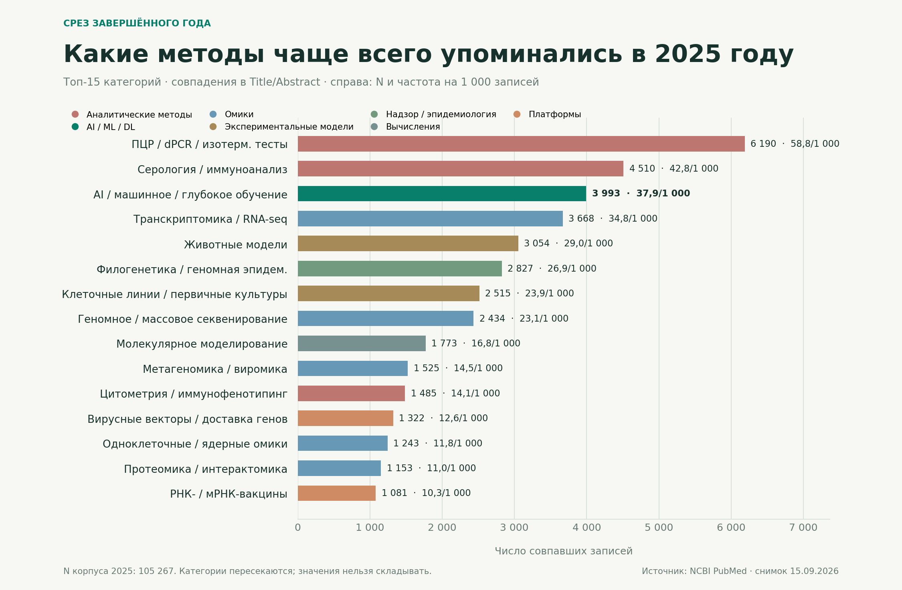
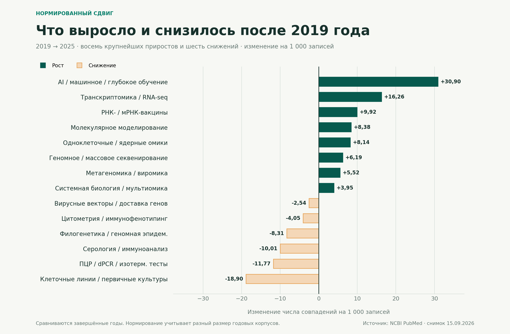
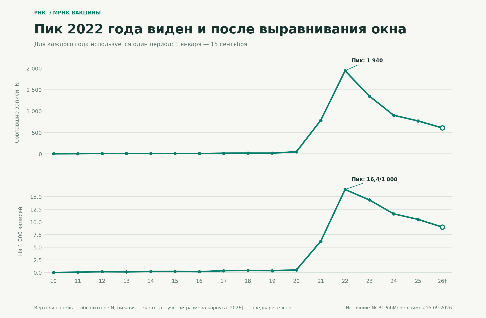
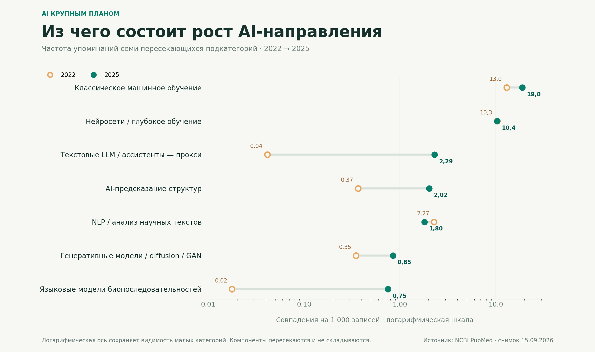

# Virology Methods Race

[](data/)
[](LICENSE)
[](https://pubmed.ncbi.nlm.nih.gov/)

Воспроизводимый анализ того, как менялась представленность 34 экспериментальных и вычислительных методов в публикациях о вирусах с 2010 по 2026 год.

**1 447 899** уникальных text-only PMID · **34** пересекающиеся категории · **17** лет · **89,28%** записей с абстрактом.


## Дополнительные ракурсы

Все фигуры построены из [`data/method-counts.tsv`](data/method-counts.tsv). Нажмите на изображение, чтобы открыть масштабируемую SVG-версию.

### Срез завершённого 2025 года

[](assets/top-methods-2025.svg)

Абсолютное число совпавших записей показано вместе с частотой на 1 000 записей. Категории пересекаются и не образуют сумму.

### Что изменилось после 2019 года

[](assets/method-momentum-2019-2025.svg)

Нормированное изменение отделяет динамику метода от изменения общего размера годового корпуса.

### Волна РНК- и мРНК-вакцин

[](assets/rna-vaccines-ytd-trend.svg)

При одинаковом окне 1 января — 15 сентября максимум остаётся в 2022 году и в абсолютных значениях, и на 1 000 записей.

### Как изменился состав AI-направления

[](assets/ai-subfields-2022-2025.svg)

Логарифмическая ось сохраняет видимость малых подкатегорий. Компоненты AI пересекаются, поэтому их нельзя складывать.

## Что здесь важно

- Основной ряд строится по фиксированным вирусным терминам только в `Title/Abstract`, без скрытого Automatic Term Mapping.
- Явный MeSH-контур считается отдельно и используется как проверка чувствительности к изменению индексирования MEDLINE.
- Единица счёта — уникальный PMID. Одна публикация может относиться к нескольким категориям.
- 2026 год показан как предварительный; отдельная фигура сравнивает одинаковое окно 1 января — 15 сентября для каждого года.

## Главные наблюдения

1. РНК- и мРНК-вакцины достигают пика в 2022 году, после чего снижаются и по абсолютному числу публикаций, и по частоте на 1 000 записей.
2. Общая AI-категория не совершает резкого скачка именно в 2024 году: меняется прежде всего её состав — быстро растут LLM, модели биопоследовательностей, AI-предсказание структур и генеративные модели.
3. Более широкий подъём AI заметен в 2025 году; ранний крупный перелом приходится на 2020–2021 годы.

Подробности: [выводы](docs/findings-ru.md) · [как читать фигуру](docs/figure-guide-ru.md) · [методология](docs/methodology-ru.md).

## Состав репозитория

| Каталог | Содержимое |
|---|---|
| `assets/` | PNG и SVG семи итоговых фигур |
| `data/` | агрегированные counts, QA, словарь, запросы и определение корпуса |
| `scripts/` | загрузка PubMed, анализ, рендер и регрессионные тесты |
| `docs/` | методология и интерпретация результатов |

Полный дедуплицированный PubMed XML занимает около 7 ГБ в gzip и намеренно не хранится в Git. Его можно воспроизвести локально.

## Воспроизведение

Требуется Python 3.11+.

```bash
python -m venv .venv
python -m pip install -r requirements.txt
python scripts/test_method_dictionary.py
python scripts/build_strict_pubmed_corpus.py --target corpus
python scripts/analyze_strict_pubmed_methods.py --recount --output-dir results
python scripts/render_additional_figures.py
```

Загрузчик возобновляет прерванную работу, ограничивает частоту запросов к NCBI, проверяет число записей и SHA-256 каждой страницы, а затем дедуплицирует корпус по PMID.

## Данные и ограничения

Репозиторий содержит библиографические агрегаты, но не издательские PDF и не полный текст статей. Исходные записи получены через [NCBI Entrez E-utilities](https://www.ncbi.nlm.nih.gov/books/NBK25501/). При повторном использовании данных необходимо соблюдать [условия и политики NCBI](https://www.ncbi.nlm.nih.gov/home/about/policies/).

Категории имеют разную ширину и измеряют упоминания методов в заголовках и абстрактах. Это не показатель качества, эффективности или фактического внедрения метода.

## Citation

Метаданные для цитирования находятся в [`CITATION.cff`](CITATION.cff).

## License

Код распространяется по лицензии [MIT](LICENSE). Данные PubMed и сторонние библиографические записи сохраняют условия соответствующих правообладателей и NCBI.
